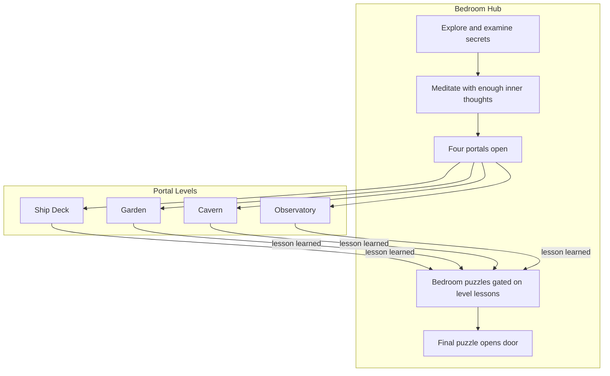

# Project Plan — Project Stillpoint

> Last updated: 2026-06-27  
> Living design doc for game vision, progression, and architecture.  
> Implementation status and session handoff: see [`Handoff.md`](Handoff.md).

## Vision

A browser-based isometric escape room. You wake trapped in a bedroom with fogged memory. The room holds secrets; meditation opens portals to other worlds. Each world teaches something you need to remember before you can finish what the bedroom has been hiding all along — and finally open the door.

**Tone:** cryptic inner voice, memory gaps, Project Stillpoint lore woven through examine text and journal clues.

## End Goal (player-facing)

1. **Explore the bedroom** — discover hidden details, journal clues, and inner thoughts scattered across props, notes, and puzzles.
2. **Use meditation as a gateway** — after collecting enough inner thoughts and holding focus, meditation reveals **"A door has opened"** and **four portals** appear on bedroom walls and floor.
3. **Visit at least four other levels** — travel through portals to distinct worlds; each has its own puzzles, props, and narrative.
4. **Learn each level's lesson** — completing a level yields insight (journal entry, flag, item, or cipher) required to progress **back in the bedroom**.
5. **Return to the room** — bring lessons home; bedroom puzzles that were locked or meaningless before now become solvable.
6. **Win** — after visiting and solving all portal levels, solve the **final bedroom puzzle** and **open the bedroom door** to escape.

## Core Progression Loop

### Design rules

| Rule | Intent |
|------|--------|
| **Bedroom is the hub** | Most long-term progress lives here; portal levels are episodes, not replacements. |
| **Meditation gates portals** | Inner-thought count + hold mechanic ensures the player has engaged with bedroom narrative before leaving. |
| **One lesson per level** | Each portal level resolves to a concrete bedroom unlock (flag, item, code, journal clue). |
| **Return is required** | You cannot skip the hub; level rewards only matter when applied back in the bedroom. |
| **Four levels minimum** | Ship Deck is level 1 of ≥4; bedroom final door requires all level lessons. |
| **Secrets are layered** | Bedroom has surface puzzles (clock, photos, safe, wardrobe, padlock) *and* deeper secrets tied to portal progression. |

## Level Roadmap

| ID | Working name | Status | Lesson → bedroom unlock |
|----|--------------|--------|-------------------------|
| `bedroom` | Bedroom (hub) | **Playable** — escape chain + 4 meditation portals | Final door (`lesson_4` + cipher disk) |
| `pirate_ship` | Ship Deck | **MVP** — thin procedural deck, chest **ANCHOR** | `lesson_1` → `wall_clock` |
| `level_2` | Garden | **MVP** — thin procedural garden, chest **GROWTH** | `lesson_2` → `painting` |
| `level_3` | Cavern | **MVP** — crystal cavern, chest **REST** | `lesson_3` → wardrobe key use |
| `level_4` | Observatory | **MVP** — star dome, chest **STILL** | `lesson_4` → `door` padlock |

> **Next phase:** expand each level from a single padlock puzzle into a fully realized world with multi-step chains, custom art, and deeper narrative. MVP validates hub-and-spoke mechanics first.

## Current Implementation (browser stack)

| Layer | Tech |
|-------|------|
| Build | Vite 6, TypeScript |
| 3D | Three.js — isometric room, click-to-move, wall rotation |
| Content | JSON under `data/` (rooms, puzzles, story) |
| Audio | Howler + synth SFX fallback |
| Deploy | GitHub Pages (`base: './'`), itch.io zip |

### Built today (hub-and-spoke MVP)

- Multi-room loading: `Game.loadRoom(roomId)` + save `currentRoom` (v2) for all five rooms
- Meditation portal gate: ≥4 heard thoughts + 5 s center hold → `meditation_portal_opened`
- **Four data-driven portals** in bedroom (`portals` in `bedroom.json`); `revealPortals()` / `syncPortals()` in `RoomBuilder`
- `Game.enterPortal(targetRoom)` — blur/fade transition to any portal level
- Return to Room from all portal levels; portals stay open (solved portals dim but re-enterable)
- Per-level **lesson flags** (`lesson_1`–`lesson_4`) re-gate bedroom puzzle beats
- Final door requires all four lessons + `cipher_disk` before STILLPOINT padlock win
- Per-room puzzles, story, and hotspot maps for `level_2` / `level_3` / `level_4`

### Not yet built (post-MVP polish)

- [ ] Fully realized portal worlds (distinct art, layout, atmosphere per level)
- [ ] Per-level multi-puzzle chains (MVP: one padlock each)
- [ ] Reverse fall cinematic on return from levels
- [ ] Deeper bedroom secrets surfaced only after specific level returns
- [ ] Dev Mode editing for portal level rooms

## Architecture (high level)

- **`Game.ts`** — main loop, room transitions, meditation, menus, autosave
- **`RoomBuilder`** — loads `data/rooms/{roomId}.json`, procedural props, bedroom-only features gated by `roomId`
- **`PuzzleManager` / `NarrativeManager`** — per-room data via `loadRoom(roomId)`
- **`MeditationOverlay`** — focus ball, thought gate, portal unlock messaging
- **`FallTransition`** — blur/fade room transitions (bedroom ↔ levels)
- **`SaveLoad`** — flags, inventory, journal, `currentRoom`, puzzle hotspot state

Data-driven content lives in:

- `data/rooms/{roomId}.json`
- `data/puzzles/{roomId}.json`
- `data/story/{roomId}-script.json`

## Data & Conventions

- Room IDs: lowercase snake_case (`bedroom`, `pirate_ship`, …)
- Puzzle consequences: `set_flag:`, `give_item:`, `journal:`, `disable_hotspot:`, etc.
- Bedroom lesson flags: `lesson_1` … `lesson_4` (set in portal level puzzles, checked in bedroom gates)
- Prefer editing JSON over hardcoding; keep bedroom-only logic guarded in `Game.ts` / `RoomBuilder`

## Near-Term Tasks

1. **Expand each portal level** — unique setting, multi-step puzzle chain, custom props/GLB, audio mood
2. **Bedroom secret pass** — audit props/hotspots for post-level reveals beyond current re-gates
3. **Return path polish** — optional reverse fall cinematic
4. Expand Playwright coverage for full escape path with real meditate hold and all four portal round-trips
5. Dev Mode support for portal level JSON

## Decisions to Track

| Decision | Choice | Notes |
|----------|--------|-------|
| Engine | Vite + Three.js (browser) | Godot MVP archived in `legacy/godot/` |
| Hub model | Bedroom-centric | Portal levels are episodes; progress consolidates at home |
| Portal unlock | Meditation + ≥4 thoughts → 4 portals at once | All portals revealed together; solved portals dim but stay enterable |
| Level count | 4 portal levels | Ship, Garden, Cavern, Observatory |
| Win condition | STILLPOINT padlock after all lessons + cipher disk | Existing bedroom chain intact; lessons added as extra gates |
| Return from levels | Blur/fade transition | Instant load at blackout; portals remain open |

## Related Docs

| Doc | Purpose |
|-----|---------|
| [`Handoff.md`](Handoff.md) | What's done, what's next, key files, checklist |
| [`README.md`](README.md) | Setup, controls, deploy |
| [`AGENTS.md`](AGENTS.md) | Agent/coding conventions |
| `data/puzzles/bedroom.json` | Current bedroom puzzle graph |
